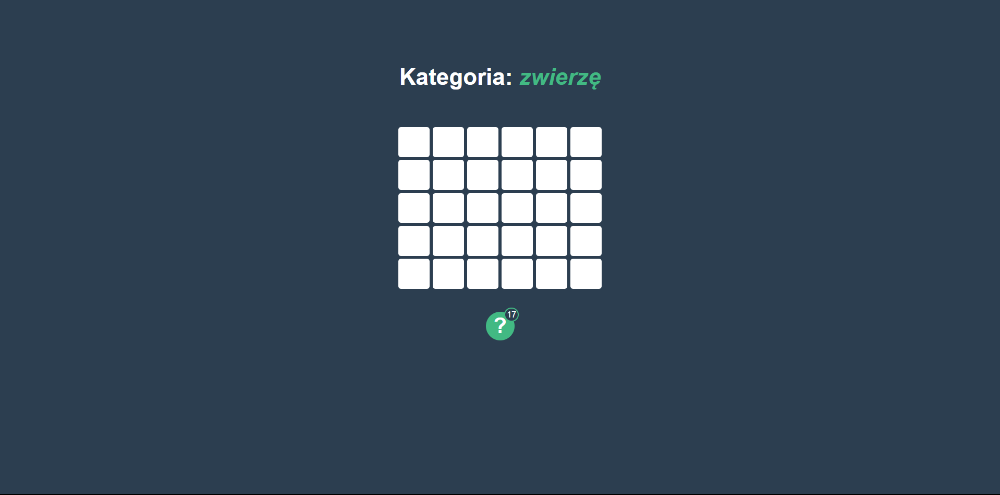
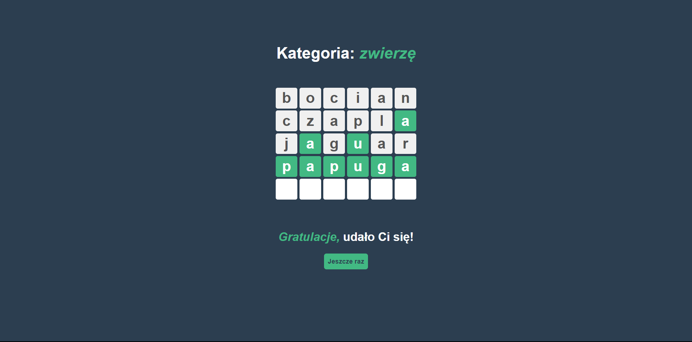
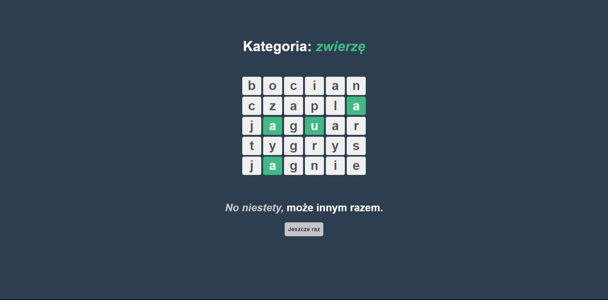
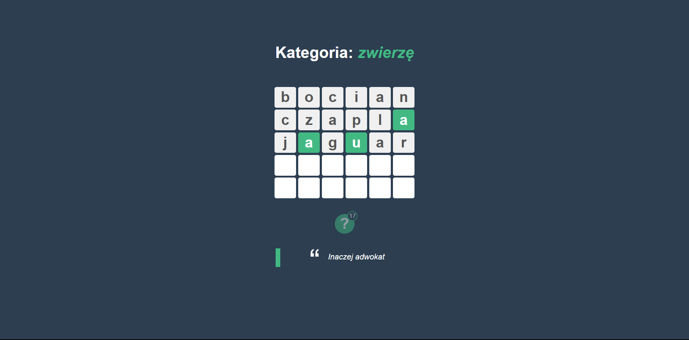
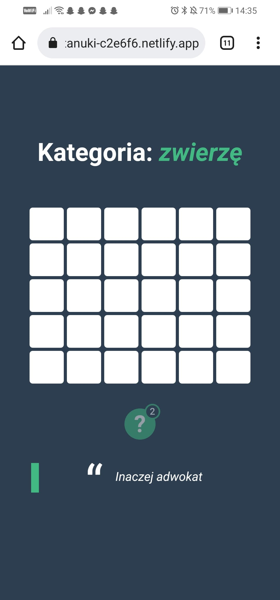

# Zgadnij słowo

> Podgląd na żywo [_tutaj_](https://gh-pages--phenomenal-tanuki-c2e6f6.netlify.app/).

## Spis treści

- [Cel](#Cel)
- [Ogólne informacje](#Ogólne-informacje)
- [Używane technologie](#Używane-technologie)
- [Stosowanie](#Stosowanie)
- [Jak tego użyć](#jak-tego-użyć)
- [Status projektu](#status-projektu)
- [Kontakt](#kontakt)
<!-- * [License](#license) -->

## Cel

- Projekt powstał by poćwiczyć vue 3, pinia

## Ogólne informacje

- Jest to gra w zgadywanie słów.
- Na to jak dojść do słowa podpowiada nam:
  - kategoria,
  - długość słowa,
  - wskazówki (jeśli mamy je dostępne)
- Słowa są pobierane albo przez api w php i mqsql lub jeśli nie odpowiada awaryjnie losowane z pliku words.json.
- W przyszłości możliwe dodanie rankingu osób z największą liczbą odkrytych słów, i poziomy trudności.

## Używane technologie

- vue: ^3.0.0
- pinia: ^2.0.14,
- gh-pages: ^4.0.0
- core-js: ^3.6.5

## Stosowanie

**Widok ogólny** To właśnie widzi osoba wchodząca pierwszy raz.

<div style="margin-bottom: 60px; text-align: center">
  
</div>

**Wygrana** Jeśli wpisze odpowiednie literki (bez znaczenia czy duże czy małe).

<div style="margin-bottom: 60px; text-align: center">
  
</div>

**Przegrana** Jeśli nie uda jej się zgadnąć.

<div style="margin-bottom: 60px; text-align: center">
  
</div>

**Użycie podpowiedzi** Na start mamy 3 podpowiedzi. Po zgadnięciu hasła dostajemy +1 a po użyciu -1. Wyświetlone zdanie może nas pośrednio lub bez pośrednio nakierować.

<div style="margin-bottom: 60px; text-align: center">
  
</div>

**Widok z telefonu**

<div style="margin-bottom: 60px; text-align: center">
  
</div>

<!-- If you have screenshots you'd like to share, include them here. -->

## Jak tego użyć

Aby sklonować i uruchomić tę aplikację, potrzebujesz [Git](https://git-scm.com) i [Node.js](https://nodejs.org/en/download/) (który jest dostarczany z [ npm](http://npmjs.com)) zainstalowany na Twoim komputerze. Z wiersza poleceń:

```bash
# Klonowanie repozytorium
$ git clone https://github.com/Maty2002v2/guess-the-word

#Wejdź do folderu repozytorium
$ cd guess-the-word

#Wejdź do folderu aplikacji
$ cd guess-the-word

# Zainstaluj zależności
$ npm install

# Uruchom aplikację
$ npm run serve
```

## Status projektu

Project is: _in progress_

## Kontakt

Stworzone przez [@Maty](mailto:mateusz_malolepszy_02@wp.pl) - nie wahaj się ze mną skontaktować!

<!-- Optional -->
<!-- ## License -->
<!-- This project is open source and available under the [... License](). -->

<!-- You don't have to include all sections - just the one's relevant to your project -->
